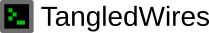
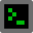

# Brand

# Logo

The TangledWires logo consists of a pixelated computer terminal drawn on an 8x8 grid, and the word 'TangledWires' written next to it in the Liberation Sans font.

## Full logo

Use this version wherever possible. There are three variants of the full logo:
1. Light mode variant, for use on a primarily light background
2. Dark mode variant, for use on a primarily dark background
3. Monochrome variant, currently unused

Light mode variant:

Dark mode variant:

Monochrome variant:

## Icon only

Use this version when there is not enough room for the full text.

Colour version:

Monochrome version:

# Colour

The primary colour is \#00be0b:

<svg width="100" height="100" viewBox="0 0 100 100" xmlns="http://w3.org"><rect width="100" height="100" fill="#00be0b" /></svg>

The secondary colour is \#6c6c6c:

<svg width="100" height="100" viewBox="0 0 100 100" xmlns="http://w3.org"><rect width="100" height="100" fill="#6c6c6c" /></svg>